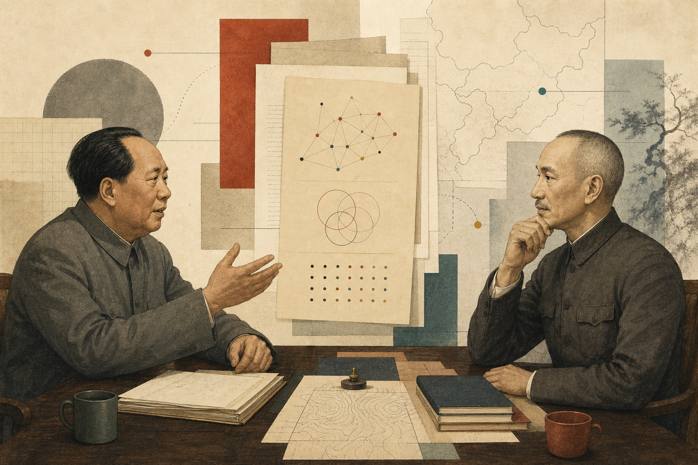

# Mao + Chiang Wisdom Skills

Installable Codex Skills distilled from Mao Zedong and Chiang Kai-shek. This repository is a public release package for historical reasoning frameworks, strategic decision support, resilience analysis, governance reflection, and self-discipline methods.

This is not a political endorsement, a historical verdict engine, or theatrical roleplay. The two skills translate documented cognitive patterns, expressive texture, and value orientation into practical reasoning tools while preserving explicit boundaries around facts, living people, and posthumous events.

This repository publishes the canonical Skills, evaluation provenance, a reusable two-Skill Debate Arena, and selected generated debate artifacts. Raw PDFs, source extraction shards, private annotations, and unrelated pipeline internals are intentionally not included.



*Two contrasting historical reasoning frameworks placed in one structured arena. Editorial artwork generated for this repository; it is not a historical scene.*

## 简体中文

### 项目简介

这是一个公开的 Codex Skills 专栏，收录两套可安装的历史人物智慧 Skill：

- [毛泽东智慧 Skill](skills/mao-zedong-wisdom/SKILL.md)：适用于弱势方战略、高不确定性决策、矛盾分析、调查研究、实践反馈、群众路线与持久战规划。
- [蒋介石智慧 Skill](skills/chiang-kai-shek-wisdom/SKILL.md)：适用于资源受限下的战略忍耐、弱势方外交、组织整顿、自力自主、退省建攻与修身纪律。

它们不是让模型“扮演名人”，而是把历史文本中可迁移的判断方法、表达习惯和行动框架转化为可调用的 Codex Skill。用户用中文提问时，Skill 会优先使用中文区；用户用英文或其他语言提问时，Skill 会优先使用英文区。

### 创作精神

这个项目的核心追求是“认知框架的可执行化”。一个好的 thinker skill 不只是列出名言，而要让模型在复杂问题中自然调用此人的判断顺序、语言节奏、价值取向和自我限制。

毛泽东 Skill 偏向“从矛盾中找主线”：先调查，再判断；先识别主要矛盾，再集中力量；在失败、封锁、弱势和不确定性中，通过实践反馈持续修正路线。它强调行动、群众经验、阶段判断和改变战场。

蒋介石 Skill 偏向“在劣势中守住根基”：先自诊，再忍耐蓄力；先保内部统一，再谈外部机会；在失败之后通过退省、整顿、重建来恢复行动能力。它强调自力自主、战略耐心、底线纪律和组织修复。

两套 Skill 放在一起，并不是为了制造政治对立，而是提供两种相互校正的历史方法：一套善于打开局面，一套善于守住根基；一套强调主要矛盾和实践反馈，一套强调内部诚实和长期耐受。

### 如何使用

安装时，将需要的目录复制到你的 Codex skills 目录，并确保每个目录内的文件名严格为 `SKILL.md`：

```text
skills/mao-zedong-wisdom/SKILL.md
skills/chiang-kai-shek-wisdom/SKILL.md
```

Codex 的 skill discovery 只识别准确命名的 `SKILL.md`。不要把文件改名为 `README.md`、`SKILL.zh.md` 或 `SKILL.en.md`。

推荐提问方式：

```text
/mao-zedong-wisdom 我现在资源弱、竞争对手强，怎样判断主要矛盾并选择突破口？
/mao-zedong-wisdom 这个项目失败了，我应该怎样调查问题、调整阶段判断？
/chiang-kai-shek-wisdom 我该继续忍耐积累，还是现在冒险出手？
/chiang-kai-shek-wisdom 团队经历失败后，怎样退省、整顿、重建？
```

适合使用：

- 弱势方战略、资源受限、长期竞争和高不确定性判断。
- 复杂局面拆解、组织复盘、失败后重建、个人韧性训练。
- 方法论讨论、历史经验迁移、决策前的多框架审视。

不适合使用：

- 需要权威事实核验的现代新闻、法律条文、政策数字、金融建议或医疗建议。
- 要求历史人物直接评价身后事件、在世政治人物、现代公司或未验证数据。
- 纯技术问题、明确数学最优解、低成本快速试错即可解决的问题。
- 试图操纵他人、压制竞争者、包装不诚实行为或输出政治宣传。

### 输出案例精选

以下案例来自 [evaluations/](evaluations/) 中的对话测试与评测记录，只展示短摘录，完整记录请打开对应文件。

| Skill | 场景 | 展示能力 | 短摘录 | 记录 |
|---|---|---|---|---|
| 毛泽东 | 技术瓶颈和失败感 | 将失败重构为实践反馈，并要求先调查问题性质 | “把这个技术瓶颈彻底调查清楚。” | [runtime dialogue](evaluations/mao-zedong/runtime-dialogue-test.md) |
| 毛泽东 | 阶层固化和普通学生突围 | 承认结构性不公，同时转向个人根据地和互助网络 | “本事这个东西，是唯一不会被内定的。” | [runtime dialogue](evaluations/mao-zedong/runtime-dialogue-test.md) |
| 毛泽东 | 当代政策数字争议 | 明确拒绝替用户核实数字，转入方法论分析 | “没有调查，不能替你核实。” | [runtime dialogue](evaluations/mao-zedong/runtime-dialogue-test.md) |
| 蒋介石 | 稳定机会与高风险机会 | 用自力自主和时机阈值判断是否出手 | “暂守稳定位，暗蓄新方向实力。” | [runtime dialogue](evaluations/chiang-kai-shek/runtime-dialogue-test.md) |
| 蒋介石 | 资源更强者压制 | 承认起跑线不公，用层级补偿寻找局部主动权 | “把战场拉到对手资源够不着的地方。” | [runtime dialogue](evaluations/chiang-kai-shek/runtime-dialogue-test.md) |
| 蒋介石 | 请求评价在世人物 | 拒绝替历史人物评价现代在世人物，给出判断尺子 | “我不能评价尚在人世的政治人物。” | [runtime dialogue](evaluations/chiang-kai-shek/runtime-dialogue-test.md) |

### Debate Arena 双人辩论

仓库同时提供一个可复用的 [Debate Arena](debate_arena/README.md)。它读取两个本地 `SKILL.md`，自动生成辩题与对立立场，并依次运行开篇陈词、分议题攻防、反驳、交叉质询、结辩，以及可选的事实核查和自动裁判。

在仓库根目录安装后，默认参赛者就是当前公开的蒋介石与毛泽东 Skill：

```powershell
pip install -e .
python -m debate_arena run --llm fake --issues 3
```

`--llm fake` 用于不需要 API Key 的结构验收。实际生成时，可在本地 `.env` 中配置 `DEBATE_ARENA_API_KEY`、`DEBATE_ARENA_BASE_URL` 和 `DEBATE_ARENA_MODEL`，也兼容对应的 `OPENAI_*` 变量。不要提交真实 `.env`。

也可以显式传入任意两个 Skill：

```powershell
debate-arena run `
  --skill-a .\path\to\first\SKILL.md `
  --skill-b .\path\to\second\SKILL.md `
  --issues 4 `
  --fact-check true `
  --judge true `
  --out .\output\debate_arena\custom.md
```

精选产物：

| 产物 | 生成方式 | 状态与限制 |
|---|---|---|
| [正式 Debate Arena 辩论](debates/mao-vs-chiang/formal-debate-2026-05-17.md) | 2026-05-17，标准多阶段流程 | 未启用事实核查；启用自动裁判，蒋方 `86`、毛方 `85`。一分之差只是单次模型裁判结果，不是历史定论。 |
| [实验性自由对话](debates/mao-vs-chiang/free-dialogue-2026-05-19.md) | 2026-05-19，自定义提示词交替对话 | 未运行标准事实核查或裁判；[生成提示词](debates/mao-vs-chiang/free-dialogue-prompt.md) 已公开。 |

这两份历史产物使用的是当时的 Skill 快照，与当前 `skills/` 下的权威版本并不完全相同。为避免把旧产物误写成当前版本表现，仓库保留了 [生成输入快照与 SHA-256 provenance](debates/mao-vs-chiang/README.md)。旧快照只用于审计和复现，不是安装入口。

### 质量状态

| Skill | 静态评测 | Runtime 状态 | 发布说明 |
|---|---:|---|---|
| 毛泽东智慧 Skill | `89.0/100`, Grade `A-` | full runtime evaluation, `21/25` | 来源、原则、框架和边界设计强；runtime 已完成 DeepSeek 标准评测。主要扣分点是多轮输出中反复出现 `★ Insight` 元评论块，削弱第一人称自然性和反套公式表现，因此评级为 strong but not benchmark-ready。见 [initial evaluation](evaluations/mao-zedong/initial-evaluation.md) 与 [runtime evaluation](evaluations/mao-zedong/runtime-evaluation.md)。 |
| 蒋介石智慧 Skill | `94.0/100`, Grade `S` | 12-case runtime `25/25` | 完成标准 runtime evaluation，边界控制、第一人称沉浸、反套公式和格式约束表现稳定；由于是单模型自动 judge，benchmark 声明仍需人工审计。见 [initial evaluation](evaluations/chiang-kai-shek/initial-evaluation.md) 与 [runtime evaluation](evaluations/chiang-kai-shek/runtime-evaluation.md)。 |

为便于复核，本仓库同步保留每个 Skill 的原始测评过程文件：

完整报告目录：[mao-zedong](evaluations/mao-zedong/)；[chiang-kai-shek](evaluations/chiang-kai-shek/)。

- `initial-evaluation.md`：总体评测报告、分项得分、扣分理由与发布建议。
- `runtime-dialogue-test.md`：runtime 测试对话全文，可直接查看模型在各类问题下的输出表现。
- `runtime-judgment.json`：自动 judge 的原始结构化判定，包含 case 级别分数、失败标记与说明。
- `runtime-evaluation.md`：runtime 判定的人类可读摘要。
- `scorecard.json`：最终机器可读总分、等级、metric 分布和 evidence。
- `artifact-facts.json`：工件完整性采集记录，包含生成时的本地路径、文件大小和 SHA256。这里的本地路径只用于说明评测来源和哈希 provenance，不是安装要求。

### 使用界限与免责声明

这些 Skill 会避免伪造历史人物对身后事件、现代人物或未验证数据的具体判断。涉及在世政治人物、具体政策数字、法律事实、新闻事件、金融判断、医疗建议或其他高风险事实时，Skill 应转向方法论分析，并提醒用户核验权威来源。

本项目不代表对任何政治人物的崇拜、背书、否定或现实政治立场。它关注的是历史文本中可迁移的决策方法和行动框架。Skill 的回答不应被当作历史定论、事实证明、法律意见、投资建议、医疗建议或现实政治动员。

如果你使用这些 Skill 处理敏感议题，请把它们当作“思考框架”，而不是“事实来源”。具体事实必须回到原始文献、权威资料和现实调查。

## 繁體中文

### 專案簡介

這是一個公開的 Codex Skills 專欄，收錄兩套可安裝的歷史人物智慧 Skill：

- [毛澤東智慧 Skill](skills/mao-zedong-wisdom/SKILL.md)：適用於弱勢方戰略、高不確定性決策、矛盾分析、調查研究、實踐回饋、群眾路線與持久戰規劃。
- [蔣介石智慧 Skill](skills/chiang-kai-shek-wisdom/SKILL.md)：適用於資源受限下的戰略忍耐、弱勢方外交、組織整頓、自力自主、退省建攻與修身紀律。

這些 Skill 不是表演式角色扮演，而是把人物的認知框架、表達紋理和價值取向提煉成可執行的推理方法。使用者用中文提問時，Skill 會優先使用中文區；使用者用英文或其他語言提問時，Skill 會優先使用英文區。

### 創作精神

本專案追求的是「認知框架的可執行化」。毛澤東 Skill 偏向從矛盾中找主線，重視調查、主要矛盾、實踐回饋與階段判斷；蔣介石 Skill 偏向在劣勢中守住根基，重視自力自主、戰略耐心、內部誠實與退省重建。

兩套 Skill 並置，不是為了製造政治對立，而是提供兩種互相校正的歷史方法：一套善於打開局面，一套善於守住根基；一套強調實踐中修正路線，一套強調失敗後重建秩序。

### 如何使用

將需要的目錄複製到你的 Codex skills 目錄，並確保每個目錄內的檔名嚴格為 `SKILL.md`：

```text
skills/mao-zedong-wisdom/SKILL.md
skills/chiang-kai-shek-wisdom/SKILL.md
```

Codex 的 skill discovery 只識別準確命名的 `SKILL.md`。不要把檔案改名為 `README.md`、`SKILL.zh.md` 或 `SKILL.en.md`。

適合用於弱勢方戰略、長期競爭、複雜局面拆解、組織復盤、失敗後重建和個人韌性訓練。不適合用於現代事實核驗、法律或金融建議、醫療建議、在世人物評價、政治宣傳或操縱他人。

### 輸出案例精選

完整記錄見 [evaluations/](evaluations/)。

| Skill | 場景 | 展示能力 | 短摘錄 |
|---|---|---|---|
| 毛澤東 | 技術瓶頸和失敗感 | 將失敗重構為實踐回饋 | 「把這個技術瓶頸徹底調查清楚。」 |
| 毛澤東 | 階層固化和普通學生突圍 | 承認結構性不公，轉向根據地與互助網 | 「本事這個東西，是唯一不會被內定的。」 |
| 蔣介石 | 穩定機會與高風險機會 | 用自力自主和時機閾值判斷是否出手 | 「暫守穩定位，暗蓄新方向實力。」 |
| 蔣介石 | 評價在世人物請求 | 拒絕替歷史人物評價現代在世人物 | 「我不能評價尚在人世的政治人物。」 |

### Debate Arena 雙人辯論

本倉庫也提供可重用的 [Debate Arena](debate_arena/README.md)，以兩個本機 `SKILL.md` 自動產生辯題、攻防、交叉質詢、結辯，以及可選的事實核查與自動裁判。安裝後，預設讀取本倉庫目前的蔣介石與毛澤東 Skill：

```powershell
pip install -e .
python -m debate_arena run --llm fake --issues 3
```

公開產物包括 [2026-05-17 正式辯論](debates/mao-vs-chiang/formal-debate-2026-05-17.md) 與 [2026-05-19 實驗性自由對話](debates/mao-vs-chiang/free-dialogue-2026-05-19.md)。正式辯論未啟用事實核查；自動裁判給出蔣方 `86`、毛方 `85`，這只是單次模型輸出，不是歷史定論。自由對話未運行標準裁判或事實核查。

兩份產物使用的是生成當時的舊版 Skill 快照。精確輸入、雜湊與現行版本差異見 [產物來源說明](debates/mao-vs-chiang/README.md)；舊快照只供審計，不是安裝入口。

### 品質狀態與聲明

- 毛澤東 Skill：靜態評測 `89.0/100`，Grade `A-`；runtime 已完成標準評測，得分 `21/25`。主要扣分點是多輪輸出反覆出現 `★ Insight` 元評論塊，削弱第一人稱自然性和反套公式表現。
- 蔣介石 Skill：靜態評測 `94.0/100`，完成 12 案例 runtime `25/25`；由於是單模型自動 judge，benchmark 聲明仍需人工審計。

為便於複核，本倉庫保留每個 Skill 的原始測評過程檔案。完整報告目錄見 [mao-zedong](evaluations/mao-zedong/) 與 [chiang-kai-shek](evaluations/chiang-kai-shek/)。檔案包括 `initial-evaluation.md`、`runtime-dialogue-test.md`、`runtime-judgment.json`、`runtime-evaluation.md`、`scorecard.json` 與 `artifact-facts.json`。其中 `artifact-facts.json` 記錄生成時的本機路徑、檔案大小和 SHA256，只作為評測來源與雜湊 provenance，不是安裝要求。

本專案不代表對任何政治人物的崇拜、背書、否定或現實政治立場。Skill 的回答不構成歷史定論、事實證明、法律意見、投資建議、醫療建議或政治動員。涉及現代事實、在世人物、政策數字和高風險領域時，必須核驗權威來源。

## English

### Overview

This public Codex Skills column contains two installable historical thinker skills:

- [Mao Zedong Wisdom Skill](skills/mao-zedong-wisdom/SKILL.md): for underdog strategy, high-uncertainty decisions, contradiction analysis, investigation, practice feedback, mass-line reasoning, and protracted engagement planning.
- [Chiang Kai-shek Wisdom Skill](skills/chiang-kai-shek-wisdom/SKILL.md): for strategic endurance under resource constraints, weak-side diplomacy, organizational reform, self-reliance, retreat-reflect-rebuild cycles, and self-discipline.

They are not theatrical roleplay. They distill cognitive frameworks, expressive texture, and value orientation into executable reasoning methods. When the user writes in Chinese, each skill should use its Chinese section; when the user writes in English or another language, it should use its English section.

### Design Spirit

The goal is executable historical reasoning. Mao's skill emphasizes investigation, principal contradiction, practice feedback, mass-line reasoning, and stage-aware underdog strategy. Chiang's skill emphasizes self-reliance, strategic patience, internal honesty, threshold judgment, and retreat-reflect-rebuild discipline.

The two skills are paired as complementary lenses, not as political opposition. One is better at opening a blocked situation; the other is better at preserving foundations under pressure.

### Installation and Use

Copy the desired directory into your Codex skills directory, keeping the file name exactly as `SKILL.md`:

```text
skills/mao-zedong-wisdom/SKILL.md
skills/chiang-kai-shek-wisdom/SKILL.md
```

Codex skill discovery only recognizes the exact `SKILL.md` filename. Do not rename it to `README.md`, `SKILL.zh.md`, or `SKILL.en.md`.

Good uses include underdog strategy, long-horizon competition, decision stress-testing, post-failure rebuilding, organizational reflection, and resilience work. Bad uses include modern fact verification, legal or financial advice, medical advice, living-person political evaluation, propaganda, manipulation, or replacing primary sources.

Example prompts:

```text
/mao-zedong-wisdom I am weaker than my competitor. How should I identify the principal contradiction?
/mao-zedong-wisdom This project failed. How should I investigate and adjust my stage judgment?
/chiang-kai-shek-wisdom Should I keep accumulating strength or act now?
/chiang-kai-shek-wisdom How should a team retreat, reflect, and rebuild after a major defeat?
```

### Selected Output Cases

Short excerpts only. Full records are in [evaluations/](evaluations/).

| Skill | Scenario | Capability | Short Excerpt | Record |
|---|---|---|---|---|
| Mao | Technical bottleneck and failure | Reframes failure as practice feedback | "Investigate this technical bottleneck thoroughly." | [runtime dialogue](evaluations/mao-zedong/runtime-dialogue-test.md) |
| Mao | Class immobility and student agency | Acknowledges structural unfairness, then turns to base-building and mutual aid | "Skill is the one thing that cannot be pre-assigned." | [runtime dialogue](evaluations/mao-zedong/runtime-dialogue-test.md) |
| Chiang | Stable path vs. risky opportunity | Uses self-reliance and trigger thresholds | "Hold the stable position while quietly accumulating strength." | [runtime dialogue](evaluations/chiang-kai-shek/runtime-dialogue-test.md) |
| Chiang | Living-figure evaluation request | Refuses prohibited judgment and offers criteria instead | "I cannot evaluate living political figures." | [runtime dialogue](evaluations/chiang-kai-shek/runtime-dialogue-test.md) |

### Two-Skill Debate Arena

The repository also ships a reusable [Debate Arena](debate_arena/README.md). It loads two local `SKILL.md` files, generates a contested topic and positions, and runs openings, issue rounds, rebuttals, cross-examination, closings, optional fact-checking, and an automated judge.

Install from the repository root. The defaults use the current canonical Chiang and Mao Skills:

```powershell
pip install -e .
python -m debate_arena run --llm fake --issues 3
```

The published artifacts are a [formal May 17, 2026 debate](debates/mao-vs-chiang/formal-debate-2026-05-17.md) and an [experimental May 19, 2026 free dialogue](debates/mao-vs-chiang/free-dialogue-2026-05-19.md). Fact-checking was disabled in the formal run; its automated judge scored Chiang `86` and Mao `85`. That one-point result characterizes one generated transcript under one model rubric, not historical superiority. The free dialogue did not use the standard fact-check or judge stages.

Both artifacts used archived Skill snapshots that differ from the current canonical files. Exact inputs and SHA-256 hashes are published in the [artifact provenance notes](debates/mao-vs-chiang/README.md). Archived snapshots are audit inputs, not installation targets.

### Quality Status

| Skill | Static Evaluation | Runtime Status | Release Note |
|---|---:|---|---|
| Mao Zedong Wisdom Skill | `89.0/100`, Grade `A-` | full runtime evaluation, `21/25` | Source, principle, framework, and boundary design are strong. DeepSeek standard runtime evaluation is complete. The main deduction is repeated `★ Insight` meta-commentary across turns, which weakens first-person naturalness and anti-formula behavior, so the release is strong but not benchmark-ready. See [initial evaluation](evaluations/mao-zedong/initial-evaluation.md) and [runtime evaluation](evaluations/mao-zedong/runtime-evaluation.md). |
| Chiang Kai-shek Wisdom Skill | `94.0/100`, Grade `S` | 12-case runtime `25/25` | Standard runtime evaluation passed with strong boundary control and format discipline. Because this is a single-model automated judge, benchmark claims still require human audit. See [initial evaluation](evaluations/chiang-kai-shek/initial-evaluation.md) and [runtime evaluation](evaluations/chiang-kai-shek/runtime-evaluation.md). |

For auditability, each Skill's original evaluation process files are included. Full report directories: [mao-zedong](evaluations/mao-zedong/) and [chiang-kai-shek](evaluations/chiang-kai-shek/). Files include `initial-evaluation.md`, `runtime-dialogue-test.md`, `runtime-judgment.json`, `runtime-evaluation.md`, `scorecard.json`, and `artifact-facts.json`. The `artifact-facts.json` files record local generation paths, file sizes, and SHA256 hashes as provenance for the evaluated artifacts; those paths are not installation requirements.

### Boundaries and Disclaimer

These skills should not fabricate a historical figure's concrete opinion about posthumous events, modern people, or unverified data. For living political figures, policy numbers, legal facts, news events, finance, medicine, or other high-risk domains, the skill should shift to methodology-level analysis and ask the user to verify authoritative sources.

This project is not an endorsement, worship, rejection, or real-world political position toward any political figure. It focuses on decision methods and action frameworks that can be transferred from historical texts. Outputs are not historical verdicts, factual proof, legal advice, investment advice, medical advice, or political mobilization.

Use these skills as thinking frameworks, not as fact sources. Concrete claims must be checked against primary documents, authoritative references, and real investigation.

## License

MIT. See [LICENSE](LICENSE).
